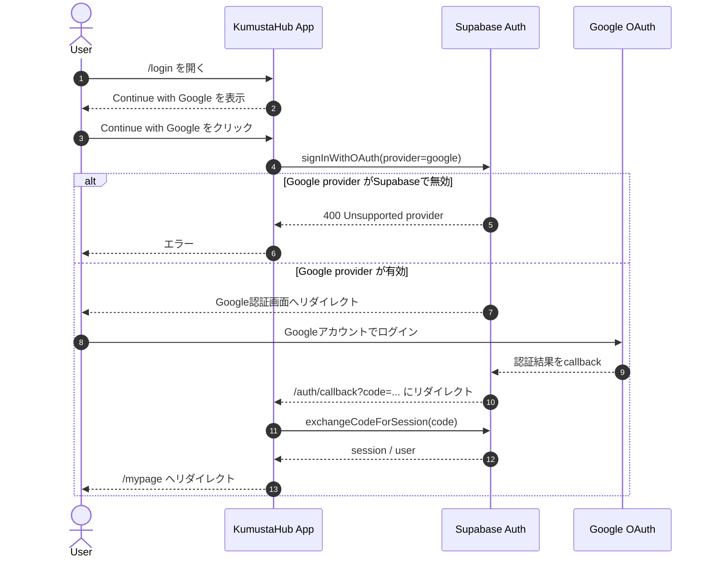
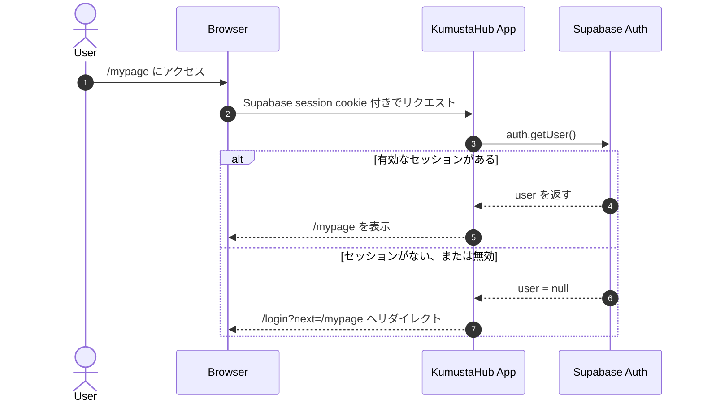
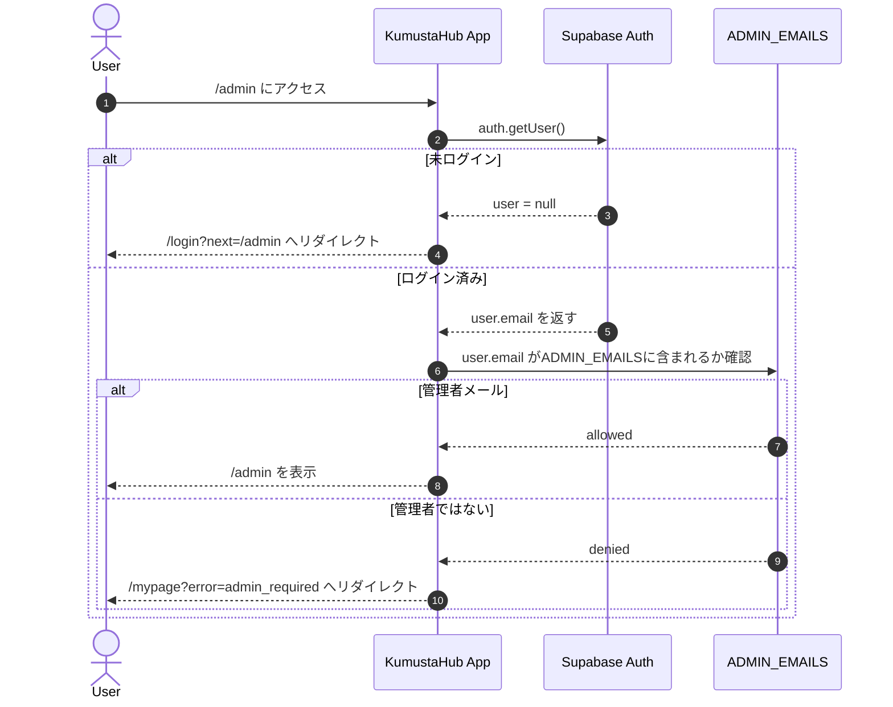

# KumustaHub 認証フロー

作成日: 2026-05-10

## このアプリでの認証方針

KumustaHub は Google/Facebook OAuth を直接処理しない。

このアプリでは Supabase Auth を認証基盤として使い、KumustaHub は Supabase が発行したセッションを見てログイン状態を判断する。

```text
KumustaHub
  -> Supabase Auth
  -> Google / Facebook
  -> Supabase Auth
  -> KumustaHub
```

## 関係するサービス

| 役割 | 担当 |
| --- | --- |
| ログインボタン表示 | KumustaHub |
| OAuth provider の開始 | Supabase Auth |
| Google/Facebook アカウント認証 | Google / Facebook |
| セッション発行 | Supabase Auth |
| セッションCookie保存 | KumustaHub |
| ログイン済み判定 | KumustaHub + Supabase Auth |
| 管理者判定 | KumustaHub の `ADMIN_EMAILS` |

## Googleログインのシーケンス



## ログイン済み判定のシーケンス



## 管理画面アクセスのシーケンス



## 実装ファイル対応

| 処理 | ファイル |
| --- | --- |
| ログイン画面 | `app/login/page.tsx` |
| OAuth開始 | `app/auth/sign-in/route.ts` |
| OAuth callback | `app/auth/callback/route.ts` |
| ログアウト | `app/auth/sign-out/route.ts` |
| Supabase server client | `lib/supabase/server.ts` |
| Supabase browser client | `lib/supabase/client.ts` |
| ログイン必須チェック | `lib/auth.ts` |
| adminメール判定 | `lib/admin.ts` |
| middleware/proxy guard | `proxy.ts` |
| ヘッダーのログイン状態表示 | `components/AuthNav.tsx` |

## 必要な環境変数

```env
NEXT_PUBLIC_SUPABASE_URL=
NEXT_PUBLIC_SUPABASE_ANON_KEY=
ADMIN_EMAILS=
```

DBも使うため、本番では以下も必要。

```env
DATABASE_URL=
DIRECT_URL=
```

## Supabase側で必要な設定

### URL Configuration

Site URL:

```text
https://kumusta-hub.vercel.app
```

Redirect URLs:

```text
https://kumusta-hub.vercel.app/auth/callback
http://localhost:3000/auth/callback
```

### Google provider

Supabase Dashboard で以下を設定する。

```text
Authentication
  -> Providers
  -> Google
  -> Enable Sign in with Google
```

Google Cloud Console で作成した OAuth client の値をSupabaseへ設定する。

```text
Client ID
Client Secret
```

Google Cloud Console 側の Authorized redirect URI には Supabase の callback URL を設定する。

```text
https://<supabase-project-ref>.supabase.co/auth/v1/callback
```

KumustaHub の `/auth/callback` ではない点に注意。

Google は Supabase に戻し、Supabase が KumustaHub に戻す。

## よくあるエラー

### 405 Method Not Allowed

原因:

- `/auth/sign-in` にGETでアクセスしているのに、POSTしか受け付けていない

現在の対応:

- `GET /auth/sign-in?provider=google&next=/mypage`
- `POST /auth/sign-in`

どちらも受け付ける。

### Unsupported provider: provider is not enabled

原因:

- Supabase Auth の Google/Facebook provider が無効

対応:

- Supabase Dashboard の `Authentication -> Providers` で対象providerを有効化する

### redirect_uri_mismatch

原因:

- Google Cloud Console の Authorized redirect URI が違う

対応:

- Google Cloud Console に Supabase callback URL を登録する

```text
https://<supabase-project-ref>.supabase.co/auth/v1/callback
```

### ログイン後にKumustaHubへ戻らない

原因:

- Supabase Auth の Redirect URLs に KumustaHub callback URL がない

対応:

- Supabase Auth の Redirect URLs に追加する

```text
https://kumusta-hub.vercel.app/auth/callback
```

## 現在の実装でまだ未対応のこと

- Supabase側の Google/Facebook provider 設定
- RLS と `auth.users` に基づくDB権限制御
- user profile テーブル
- admin role のDB管理
- 口コミ投稿時の user id 紐付け
- 写真アップロード時の Supabase Storage policy

