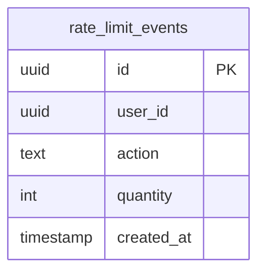
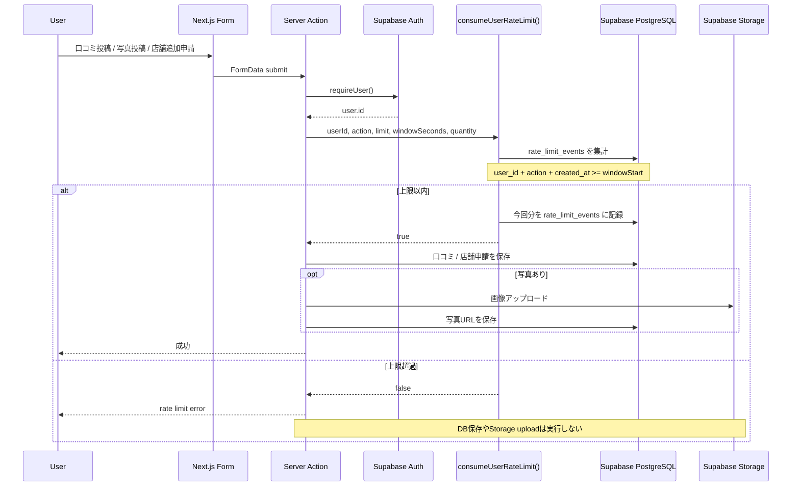
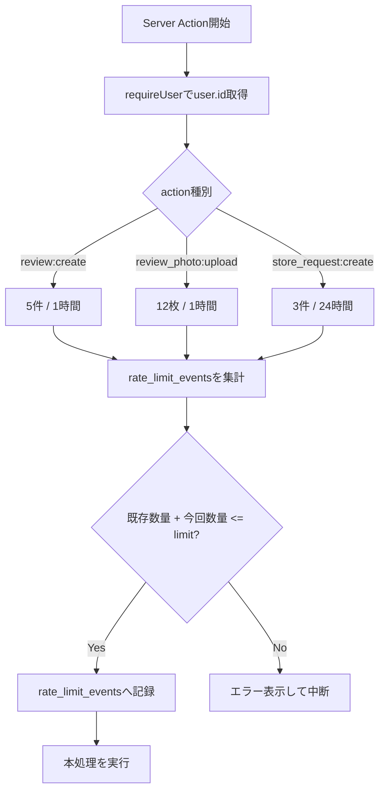

# KumustaHub RATE LIMIT

更新日: 2026-05-17

このドキュメントは、KumustaHub の投稿系 rate limit の実現方式を説明する。

## 目的

投稿型サービスとして、正式リリース前に以下を防ぐ。

- 口コミの短時間大量投稿
- 口コミ写真アップロードによるStorage急増
- 店舗追加申請の連投

現時点では user単位の最小対策を先行している。IP単位制限や Turnstile / reCAPTCHA は未導入。

## 対象アクション

| action | 対象 | 上限 |
| --- | --- | --- |
| `review:create` | 口コミ投稿 | 5件 / 1時間 |
| `review_photo:upload` | 口コミ写真アップロード | 12枚 / 1時間 |
| `store_request:create` | 店舗追加申請 | 3件 / 24時間 |

## データモデル

Rate limit は `rate_limit_events` にイベントを記録して実現する。



主なindex:

```sql
CREATE INDEX rate_limit_events_user_id_action_created_at_idx
ON rate_limit_events(user_id, action, created_at);
```

## 処理フロー



## 判定ロジック



実装箇所:

- `lib/rate-limit.ts`
- `app/stores/[slug]/actions.ts`
- `app/store-request/actions.ts`

## 採用理由

Vercel の serverless 環境では、メモリ上のカウンタはインスタンス間で共有されない。そのため Supabase PostgreSQL にイベントを記録し、どのserver action実行環境からも同じ制限状態を参照できるようにしている。

## 現在の制約

- user単位の制限なので、IP単位の匿名bot対策にはならない。
- 厳密な同時実行制御ではないため、同時連打を完全には防げない。
- 古い `rate_limit_events` は server action 実行時に7日超過分を削除する簡易運用。
- Turnstile / reCAPTCHA は、実運用でbotや連投が確認された段階で追加検討する。
